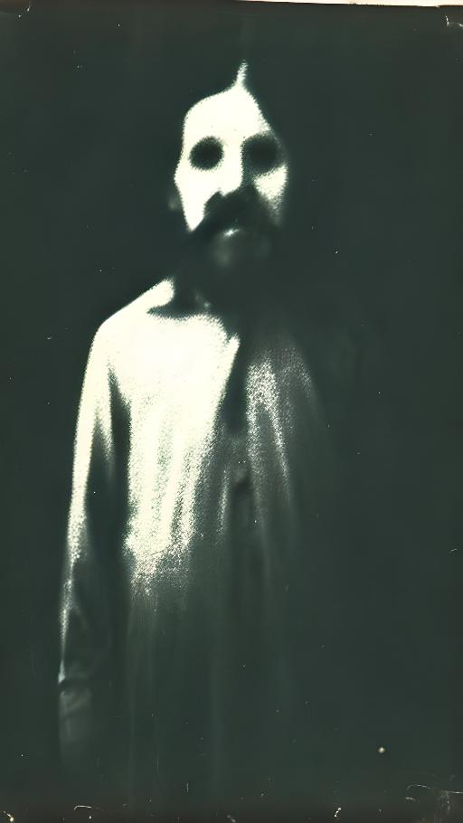

---

# Reflexiones en la Oscuridad: Explorando lo Inexplorado

En un mundo donde la racionalidad y el materialismo han tomado el mando, los espacios para el misticismo y lo inexplicable parecen haberse reducido. Brad Baumgartner, en su obra "Weird Mysticism", desafía esta noción, llevando al lector a un viaje a través de los laberintos del misticismo, el horror, y la filosofía. ¿Pero qué puede revelar este viaje sobre nuestra realidad y existencia?

### El Tejido de lo Real y lo Imaginario

Baumgartner traza un mapa donde los caminos de la filosofía y el horror se entrecruzan, explorando obras de pensadores como Thomas Ligotti, Georges Bataille, y E.M. Cioran. Estos autores, a través de su "mística extraña", revelan una síntesis entre lo humano y lo no humano, desafiando nuestras percepciones de la realidad.

> ¿Cómo redefine nuestra comprensión del mundo la intersección del horror y la filosofía?

### Espejos de la Existencia: Reflexiones Pesimistas

En un mundo cada vez más inclinado hacia el realismo especulativo y el pesimismo, Baumgartner encuentra en la "mística extraña" una herramienta crítica. Esta perspectiva ofrece una visión radical y poco convencional de la realidad, desplazando los paradigmas tradicionales de interpretación y existencia.

### Diálogos entre Dimensiones: La Interconexión de Disciplinas

El libro no solo se centra en la literatura de horror y la filosofía, sino que también establece un diálogo con otras disciplinas, demostrando cómo la "mística extraña" puede servir como un medio para explorar diversas áreas del conocimiento humano.

> ¿Qué nuevas comprensiones podemos alcanzar al aplicar la "mística extraña" en diferentes campos de estudio?

### Ecos Contemporáneos: Resonancias en el Debate Moderno

"Weird Mysticism" se sitúa en el corazón de los debates contemporáneos sobre la naturaleza de la realidad, la conciencia, y la condición humana. Baumgartner toca temas que resuenan profundamente en una era definida por la incertidumbre y el cuestionamiento de las verdades establecidas.

### Iluminando la Oscuridad

En su exploración de la "mística extraña", Brad Baumgartner nos invita a reconsiderar nuestras ideas preconcebidas sobre la realidad, la existencia y el conocimiento. "Weird Mysticism" no solo es un análisis de obras literarias y filosóficas; es una invitación a embarcarnos en un viaje hacia lo desconocido de nuestra propia existencia.

> ¿Hasta dónde estamos dispuestos a explorar en nuestra búsqueda de entender lo incomprensible?

---
