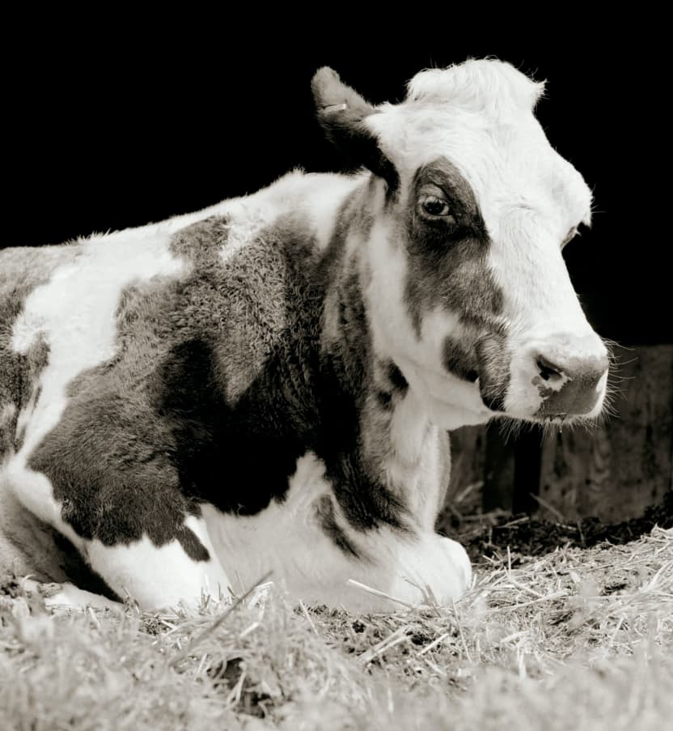

---

El libro "Allowed to Grow Old: Portraits of Elderly Animals from Farm Sanctuaries" de Isa Leshko es una conmovedora exploración de la vejez en los animales de granja rescatados y alojados en santuarios. Mediante fotografías y relatos, Leshko presenta a estos animales como individuos dotados de personalidad y dignidad, desafiando las percepciones comunes sobre ellos. Las historias individuales de estos animales, marcadas por el abandono, el maltrato y, finalmente, el cuidado amoroso en los santuarios, son presentadas con un profundo respeto y empatía. Este trabajo no solo documenta sus vidas en su fase tardía, sino que también ofrece una reflexión sobre la mortalidad, la compasión y la relación entre humanos y animales.

---

### Reflexiones en el Crepúsculo de la Vida

> ¿Qué nos pueden enseñar los animales de granja sobre la vejez, la supervivencia y la dignidad?

### Retratos de Resistencia y Renovación

Leshko captura en sus fotografías no solo la edad avanzada de estos animales, sino también su fortaleza y su capacidad para superar adversidades. Estas imágenes desafían la noción de que los animales de granja son meros recursos, mostrando su individualidad y su habilidad para formar vínculos afectivos.

### Memorias de un Pasado Doloroso

La historia de cada animal, marcada por el sufrimiento y la negligencia previos a su rescate, es un testimonio de la crueldad humana y de la capacidad de resiliencia y recuperación. Estos relatos plantean cuestiones críticas sobre el trato ético de los animales y la necesidad de un cambio en la percepción y el tratamiento de los animales de granja.

### En el Corazón de la Empatía

> ¿Cómo cambia nuestra comprensión sobre los animales de granja y sobre nosotros mismos cuando enfrentamos su vulnerabilidad y nuestra responsabilidad hacia ellos?

### El Legado de la Longevidad

Analizando la importancia de los santuarios y la atención especializada que ofrecen, Leshko resalta cómo estos lugares proporcionan no solo un refugio, sino también una oportunidad para que los animales vivan sus últimos días con dignidad y cuidado, algo que raramente experimentan sus congéneres en entornos de producción industrial.

### Entre el Arte y el Activismo

El trabajo de Leshko se sitúa en la intersección del arte y el activismo, utilizando la fotografía como un medio para fomentar una mayor conciencia y empatía hacia los animales de granja. Su enfoque desafía las convenciones tradicionales en la fotografía de animales y plantea preguntas sobre la representación y la ética.

### Conclusiones: Miradas que Cambian Perspectivas

La obra de Leshko no solo documenta la vejez en los animales de granja, sino que también invita a una reflexión más amplia sobre el trato que reciben estos animales en la sociedad. A través de su lente, somos testigos de la belleza, la complejidad y la dignidad inherente a estos seres a menudo olvidados o malentendidos.
