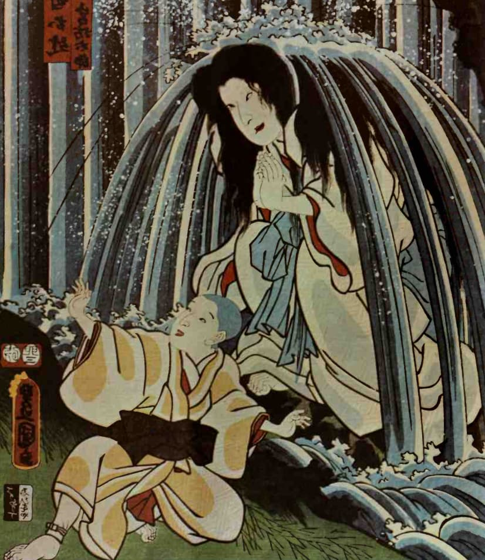
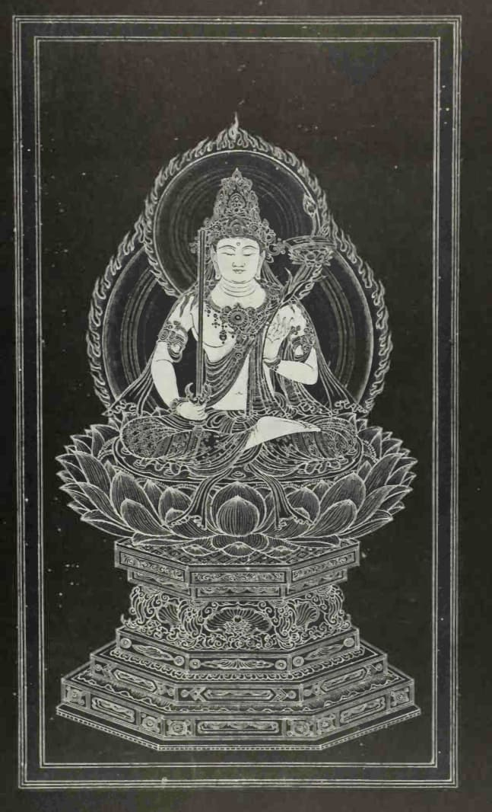
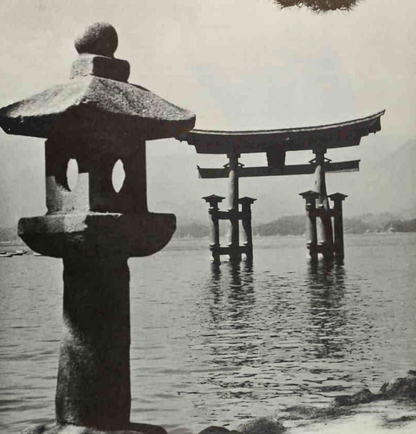

---

# **Explorando el Laberinto de los Mitos Japoneses**

### **La Encrucijada de los Dioses y Hombres**

Los mitos japoneses, ricos en dioses, diosas, héroes y monstruos, ofrecen una ventana a un mundo donde lo divino y lo mortal se entrelazan intrincadamente. ¿Cómo estas historias antiguas, con sus enseñanzas y moralejas, se reflejan en el Japón contemporáneo y en nuestras propias vidas?

### **Ecos del Pasado en el Presente**

Juliet Piggott, en _Japanese Mythology_, nos guía a través de un viaje que comienza con la creación del mundo y nos lleva a través de aventuras semidivinas, destacando la importancia de seres espirituales y criaturas míticas. Pero, ¿qué relevancia tiene este tapiz mitológico en nuestro mundo actual?

> ¿Cómo pueden los mitos antiguos iluminar nuestros desafíos contemporáneos?

### **Un Puente entre Mundos**

La obra de Piggott no solo narra fascinantes historias, sino que también teje conexiones con la vida moderna, mostrando cómo estos relatos antiguos siguen resonando en la sociedad japonesa actual. ¿Cómo pueden estas historias informar nuestros debates sobre temas como la naturaleza, la espiritualidad y la comunidad?

### **Reflejos de lo Eterno**

La mitología japonesa, con sus narrativas sobre creación, valentía y redención, ofrece perspectivas únicas sobre la condición humana. A través de los ojos de Piggott, descubrimos cómo estas historias ancestrales continúan formando la identidad cultural y espiritual de Japón. ¿Podrían estos mitos ofrecernos claves para enfrentar los dilemas éticos y ecológicos de nuestra era?

### **Tejiendo el Futuro con Hilos del Pasado**

Al final, _Japanese Mythology_ de Juliet Piggott se revela como un espejo que refleja tanto el pasado como el futuro, invitándonos a reflexionar sobre cómo las historias de antaño pueden guiar nuestras acciones hoy. ¿Qué lecciones podemos aprender de estos mitos para construir un futuro más armonioso y sostenible?

Los mitos japoneses, ricos en lecciones y sabiduría, nos desafían a mirar más allá de la superficie, a buscar las conexiones profundas entre nuestras vidas y las historias que han modelado civilizaciones. En este diálogo entre lo antiguo y lo moderno, encontramos no solo entretenimiento, sino también guía, inspiración y, quizás, la clave para los dilemas que enfrentamos en el presente.

---
