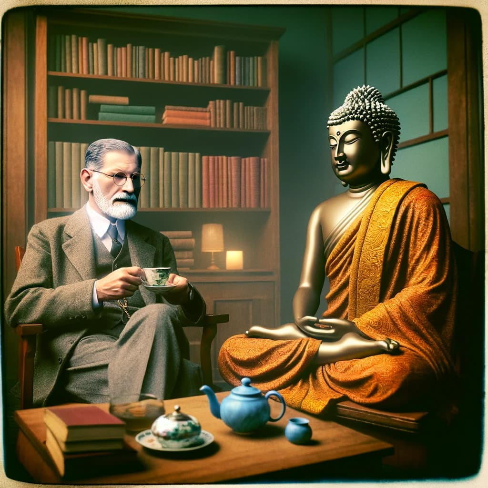
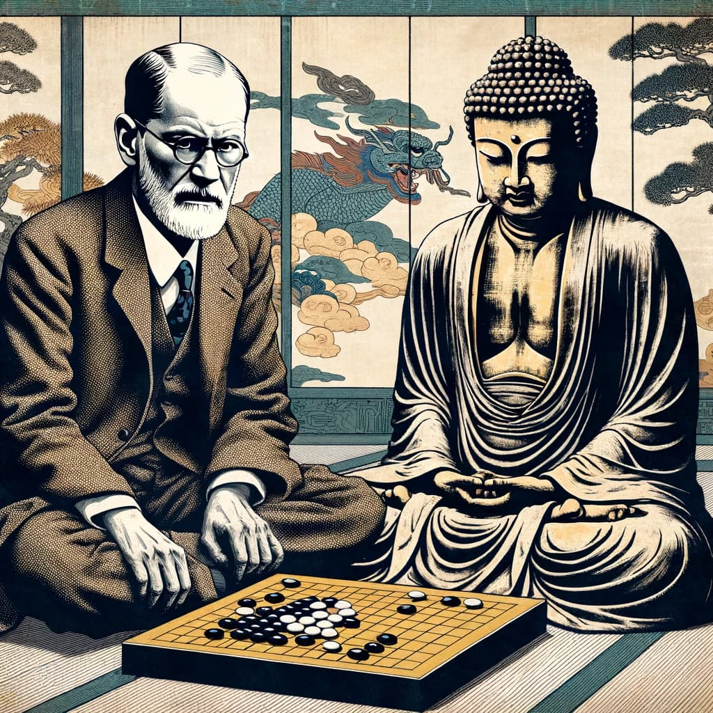
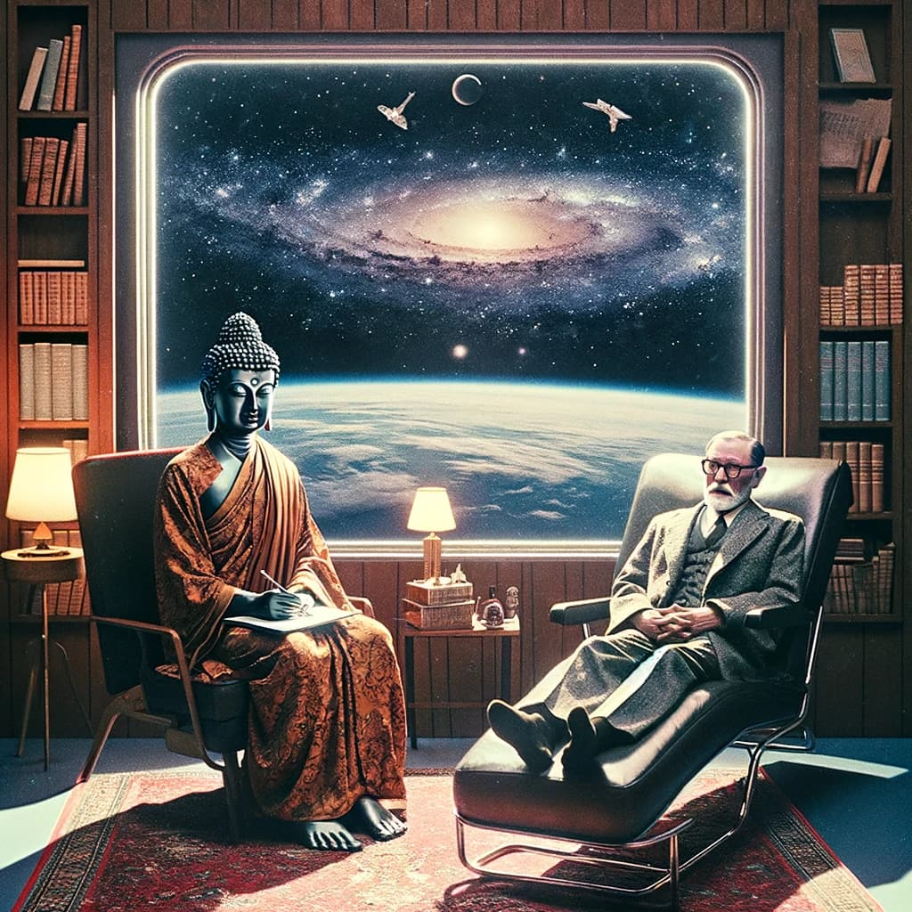

---

# Explorando la Convergencia de Mundos: "Psychotherapy and Buddhism" de Jeffrey B. Rubin

La intersección entre la psicoterapia occidental y las enseñanzas budistas ha sido durante mucho tiempo un terreno fértil para el debate y la exploración. Jeffrey B. Rubin, en su obra "Psychotherapy and Buddhism", lleva a cabo un viaje intelectual y espiritual, fusionando estas dos disciplinas aparentemente dispares. Pero, ¿qué podemos aprender de esta convergencia sobre la naturaleza de la mente humana y el proceso de sanación?

### Un Viaje Hacia la Integración

El libro de Rubin no solo propone una unión entre la psicoterapia y el budismo, sino que también desafía al lector a considerar cómo dos sistemas tan diferentes pueden complementarse y enriquecerse mutuamente. La psicoterapia, con sus raíces en la ciencia y la medicina occidentales, y el budismo, una filosofía oriental milenaria, se encuentran en un diálogo que Rubin maneja con maestría.

> ¿Cómo pueden coexistir y complementarse la sabiduría oriental y las prácticas psicoterapéuticas occidentales?

### Rompiendo Paradigmas: Mente, Sufriemiento y Sanación

Rubin aborda temas fundamentales como el sufrimiento, la naturaleza del ego y la conciencia. Desde la perspectiva budista, el sufrimiento es una parte ineludible de la existencia humana, mientras que la psicoterapia occidental a menudo se enfoca en el alivio del sufrimiento a través de métodos clínicos. Al fusionar estas dos visiones, Rubin ofrece una perspectiva más rica y profunda sobre cómo enfrentamos y procesamos el dolor y la angustia en nuestras vidas.

### La Relevancia Contemporánea de una Convergencia Milenaria

En un mundo cada vez más globalizado, donde las fronteras culturales son más permeables, la obra de Rubin cobra especial relevancia. Su enfoque integrador refleja un creciente interés en terapias alternativas y en una comprensión más holística de la salud mental. Al mismo tiempo, responde a los debates contemporáneos sobre la interconexión entre ciencia y espiritualidad, y cómo estas pueden colaborar para una comprensión más completa del ser humano.

> ¿Cómo puede este enfoque integrador enriquecer nuestra comprensión actual del bienestar mental y emocional?

### Un Puente Entre Dos Mundos

Lo más notable del libro de Rubin es su capacidad para respetar la integridad de ambas tradiciones - la psicoterapéutica y la budista - sin diluir ninguna de ellas. Propone un camino hacia una práctica terapéutica que no solo aborda el sufrimiento humano desde un enfoque más compasivo y consciente, sino que también ofrece herramientas prácticas para la transformación personal.

### Más Allá de la Mente y el Espíritu

"Psychotherapy and Buddhism" es un testamento de la posibilidad de un diálogo fr

uctífero entre diferentes sistemas de pensamiento y práctica. La obra de Rubin nos invita a reflexionar sobre nuestras propias concepciones de la mente, el sufrimiento y la sanación, y nos alienta a explorar nuevas formas de entender y tratar el malestar humano.

> ¿Podemos encontrar en la integración de la psicoterapia y el budismo un camino hacia una mayor comprensión de nosotros mismos y de los demás?

La propuesta de Rubin no solo es un llamado a la reflexión, sino también una invitación a la acción. A través de este libro, se nos anima a mirar más allá de nuestras concepciones tradicionales y a abrazar un enfoque más inclusivo y compasivo hacia el bienestar mental y emocional. En un mundo donde los desafíos de la salud mental están cada vez más presentes, este libro ofrece una perspectiva refrescante y necesaria, uniendo la sabiduría antigua con el conocimiento moderno para iluminar el camino hacia la sanación y el crecimiento personal.

---
