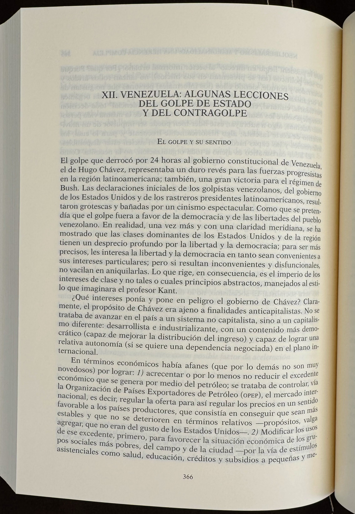
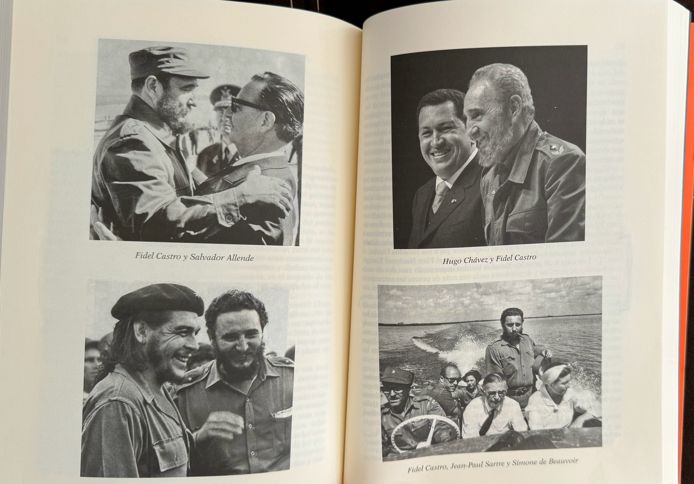

---

<iframe width="560" height="515" src="https://www.youtube.com/embed/7Pj1Pe84TLk?si=kjI6s5mxmwYmCGS8" title="YouTube video player" frameborder="0" allow="accelerometer; autoplay; clipboard-write; encrypted-media; gyroscope; picture-in-picture; web-share" referrerpolicy="strict-origin-when-cross-origin" allowfullscreen></iframe>

---

# ¿Capitalismo o Socialismo?: La Encrucijada de Nuestro Tiempo

En un mundo que enfrenta desafíos económicos y sociales sin precedentes, la dicotomía entre _capitalismo_ y _socialismo_ sigue siendo una cuestión candente. José Valenzuela Feijóo, en su libro "¿Capitalismo o socialismo?", se sumerge en este debate eterno, explorando las virtudes y defectos de ambos sistemas. ¿Es posible encontrar una alternativa viable que combine lo mejor de ambos mundos? ¿O estamos condenados a elegir entre dos extremos imperfectos?

### *El Ocaso del Capitalismo*

La primera parte del libro aborda la _decadencia del capitalismo_. Valenzuela Feijóo describe cómo el sistema capitalista ha evolucionado desde sus orígenes frugales hasta convertirse en un modelo parasitario. Esta transformación ha generado profundas desigualdades y ha exacerbado problemas sociales y económicos.

> "¿Puede el capitalismo, en su forma actual, sostener un crecimiento equitativo y sostenible a largo plazo?"

La exploración de Feijóo sobre el **parasitismo económico** del capitalismo contemporáneo ofrece una perspectiva crítica y profunda. El autor destaca cómo el sistema se alimenta de sí mismo, creando una concentración de riqueza y poder en manos de unos pocos, mientras la mayoría sufre las consecuencias de la explotación y la marginación.

### *El Desafío de la Transición*

Uno de los temas centrales del libro es el **proceso de transición** hacia el socialismo. Valenzuela Feijóo analiza los desafíos y obstáculos que enfrenta una economía planificada. A través de ejemplos históricos, como la experiencia soviética y las diversas _experiencias latinoamericanas_, el autor ilustra las dificultades inherentes a la implementación de un sistema socialista.

> "¿Es posible llevar a cabo una transición al socialismo sin sacrificar las libertades individuales y la democracia?"

La discusión sobre la _NEP (Nueva Política Económica)_ y la acumulación acelerada subraya las contradicciones y dilemas que surgen cuando se intenta construir una economía socialista en un contexto predominantemente capitalista. La crítica al **marxismo vulgar** y los problemas pendientes que se derivan de interpretaciones simplistas del socialismo enriquecen el debate y ofrecen una visión matizada de las complejidades involucradas.

### *Una Visión Crítica del Eurocomunismo*

Valenzuela Feijóo no se limita a una sola perspectiva del socialismo. El análisis del **Eurocomunismo** y su intento de reconciliar socialismo y democracia aporta una dimensión importante a la discusión. El autor explora cómo esta corriente busca adaptar los principios socialistas a las realidades políticas y económicas de Europa Occidental, destacando tanto sus logros como sus limitaciones.

> "¿Puede el Eurocomunismo ofrecer un modelo viable para un socialismo democrático en el siglo XXI?"

La crítica a las posturas neoliberales que intentan apropiarse del socialismo revela las tensiones entre las diversas interpretaciones y aplicaciones del socialismo en el mundo contemporáneo. Esta reflexión es crucial para entender las posibles _futuras transiciones_ y las formas en que el socialismo podría evolucionar para enfrentar los desafíos actuales.

### *Reflexiones Latinoamericanas*

La tercera parte del libro se enfoca en las _experiencias latinoamericanas_, proporcionando un análisis detallado de los intentos de implementación del socialismo en esta región. Feijóo examina casos como el de la Unidad Popular en Chile, resaltando los aspectos centrales de su programa económico y la dinámica del proceso.

> "¿Qué lecciones pueden extraerse de las experiencias socialistas en América Latina para futuros movimientos de transformación social?"

La discusión sobre el papel de la **clase obrera**, la burguesía nacional y la heterogeneidad estructural ofrece una visión integral de los factores que influyen en la implementación y sostenibilidad de proyectos socialistas en contextos diversos. La reflexión sobre el _neoliberalismo_ y su impacto en las economías latinoamericanas enriquece el debate y aporta perspectivas críticas sobre las políticas económicas contemporáneas.

### *Mirando Hacia el Futuro*

En la parte final, Valenzuela Feijóo se pregunta _¿dónde y cuándo emergerá el socialismo?_. Esta cuestión invita a una reflexión profunda sobre las condiciones necesarias para el surgimiento de un sistema socialista y los desafíos que enfrenta en un mundo globalizado y desigual.

> "¿Qué factores podrían catalizar una transición global hacia el socialismo en el siglo XXI?"

La exploración de las **perspectivas futuras** del socialismo y el comunismo ofrece una visión esperanzadora pero realista sobre las posibilidades de transformación social. Feijóo argumenta que, a pesar de los numerosos desafíos, existen _factores de estabilización_ y _presión_ que podrían facilitar la emergencia de un nuevo orden económico y social.

### *Conclusión: La Encrucijada de Nuestro Tiempo*

"¿Capitalismo o socialismo?" es una obra imprescindible para cualquiera que busque entender los dilemas y desafíos económicos de nuestro tiempo. José Valenzuela Feijóo ofrece un análisis riguroso y perspicaz que invita a una reflexión profunda sobre los sistemas que gobiernan nuestras vidas. La elección entre capitalismo y socialismo no es simplemente una cuestión económica, sino una decisión sobre el tipo de sociedad en la que queremos vivir.

> "¿Estamos preparados para enfrentar los desafíos de una transición hacia un nuevo modelo económico que priorice la equidad, la sostenibilidad y la justicia social?"

En última instancia, el libro nos recuerda que el futuro está en nuestras manos y que es nuestra responsabilidad construir un mundo más justo y equitativo para las generaciones venideras.

---
