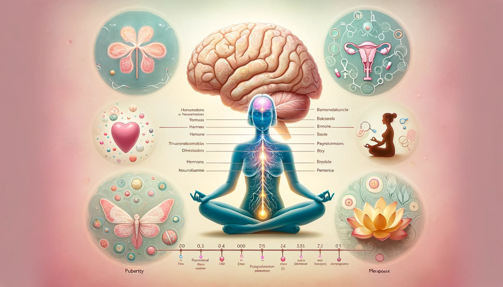

---

# **Explorando el Universo Femenino: Un Viaje por "The Female Brain"**

## **Un Espejo al Alma Femenina**

El cerebro femenino, esa compleja maravilla, ¿es tan diferente del masculino? Louann Brizendine en su obra "The Female Brain" nos adentra en un viaje fascinante por el universo neurobiológico femenino. Pero, ¿hasta qué punto estos descubrimientos redefinen nuestra comprensión de la mujer moderna?

> ¿Cómo influyen las diferencias biológicas en nuestras vidas cotidianas?

## **La Danza Hormonal: Más que Simple Química**

Brizendine nos ilustra cómo desde la pubertad hasta la menopausia, las hormonas moldean no solo el cuerpo sino la mente y emociones de la mujer. A través de casos y estudios, descubrimos un panorama donde cada etapa de la vida femenina es una nueva melodía hormonal.

> ¿Qué papel juegan realmente nuestras hormonas en la forma en que pensamos y sentimos?

## **La Controversia: Más allá de los Estereotipos**

Este libro, situado en el epicentro de debates contemporáneos, despierta cuestionamientos sobre género y neurociencia. Mientras algunos elogian su enfoque en la neurociencia femenina, otros critican la posibilidad de reforzar estereotipos. Brizendine, sin embargo, busca un equilibrio entre ciencia y sensibilidad social.

> ¿Reforzamos estereotipos al hablar de diferencias cerebrales entre hombres y mujeres?

## **El Cerebro Femenino en la Sociedad Actual**

En una época donde la igualdad de género es primordial, "The Female Brain" ofrece un enfoque científico que podría iluminar y enriquecer nuestra comprensión de la identidad femenina. Brizendine nos invita a considerar cómo la biología y la experiencia se entrelazan, formando la tapeztria única de la vida de cada mujer.

> ¿Cómo podemos utilizar este conocimiento para mejorar la comprensión y aceptación entre géneros?

## **Rompiendo Barreras: La Mujer en la Ciencia**

La obra de Brizendine se sitúa en el corazón de una época que desafía activamente los roles y estereotipos de género. Al explorar la neurología femenina, el libro propone una nueva forma de entender la contribución única de las mujeres en campos como la ciencia y la tecnología, tradicionalmente dominados por hombres.

> ¿Cómo puede el entendimiento del cerebro femenino influir en la representación de las mujeres en la ciencia y la tecnología?

## **La Inteligencia Emocional: Un Don Femenino**

El libro destaca la habilidad innata de las mujeres para la inteligencia emocional, una herramienta poderosa en la interacción social y el liderazgo. Brizendine sugiere que esta capacidad, moldeada por la estructura y química cerebral, es una fuerza que debe ser reconocida y valorada en todos los ámbitos de la sociedad.

> ¿De qué manera la inteligencia emocional contribuye al éxito y bienestar en nuestra sociedad?

## **Un Futuro Integrador**

"The Female Brain" no es solo un estudio sobre las diferencias de género; es una invitación a apreciar y comprender la complejidad del cerebro humano. Al final, Brizendine nos lleva a una reflexión más amplia sobre cómo la biología y la experiencia se entrelazan para crear individuos únicos, más allá de las etiquetas de género.

> ¿Cómo podemos, como sociedad, utilizar este conocimiento para construir un futuro más inclusivo y comprensivo?

---
