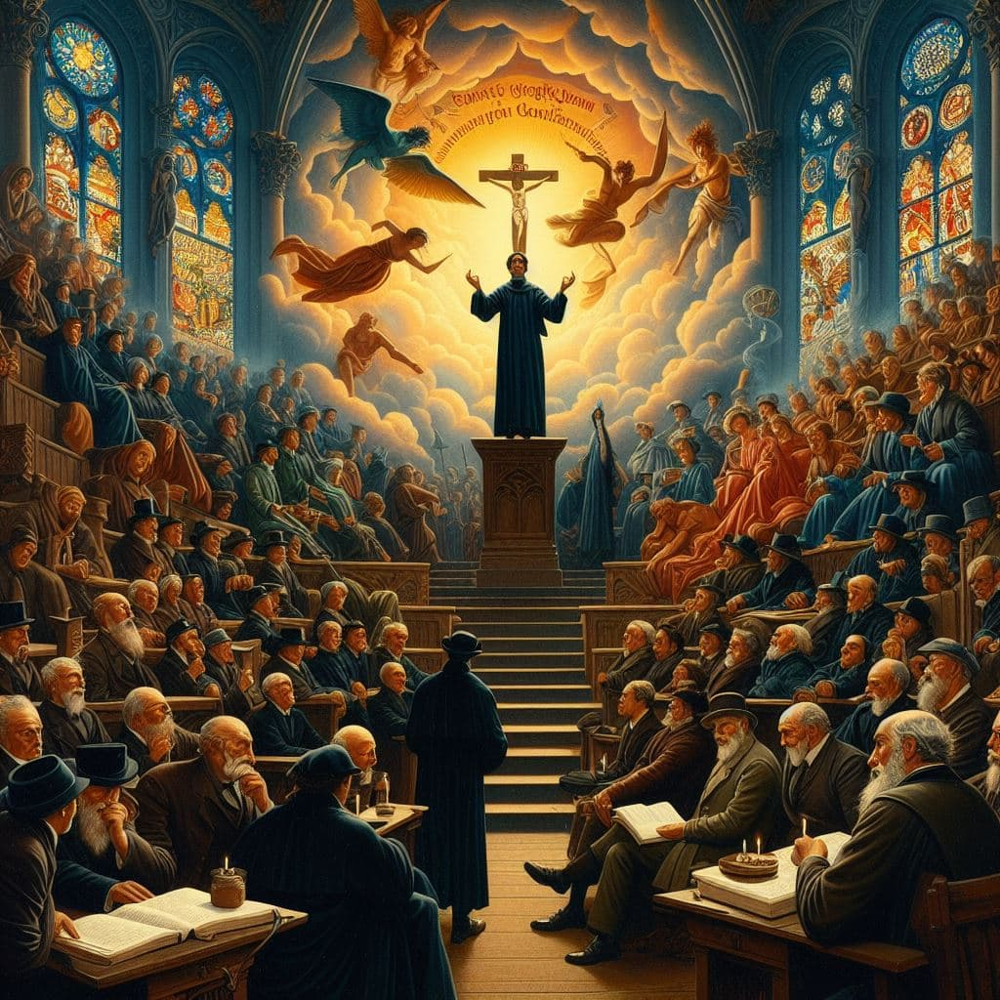

---

# La Ética Protestante y la Modernidad Económica: Un Análisis de Max Weber

## Reflexiones Iniciales: ¿Cómo moldean las creencias nuestras economías?

Max Weber, en su monumental obra "La ética protestante y el espíritu del capitalismo", propone una idea revolucionaria: que las creencias religiosas, específicamente el protestantismo, jugaron un papel crucial en el desarrollo del capitalismo moderno. ¿Pero cómo pueden las creencias religiosas influir en sistemas económicos enteros? Este artículo explora esta intrigante conexión, cuestionando cómo nuestras creencias individuales y colectivas pueden dar forma a realidades económicas y sociales.

### El Nexo entre Fe y Finanzas

> ¿Hasta qué punto nuestras creencias religiosas impactan nuestras prácticas económicas?

Weber postula que el protestantismo, especialmente el calvinismo, promovía valores como la disciplina, el trabajo duro y la austeridad. Estos valores no solo eran espirituales sino que también tenían implicaciones económicas. El éxito económico se convirtió en una señal de favor divino, incentivando una ética de trabajo que era inherentemente compatible con los principios del capitalismo emergente.

### Una Visión Contemporánea de Weber

En el mundo moderno, donde la economía y la religión parecen seguir esferas separadas, ¿sigue siendo relevante el análisis de Weber? La respuesta es un resonante sí. Su enfoque nos ayuda a comprender cómo los sistemas de creencias pueden influir en prácticas económicas, y viceversa. En una era de creciente diversidad religiosa y espiritual, las ideas de Weber nos invitan a considerar cómo las nuevas formas de espiritualidad pueden influir en las economías del futuro.

> ¿Cómo nuestras convicciones más profundas dan forma a las estructuras de nuestra sociedad? ¿Somos producto de nuestras creencias?

Weber nos enseña que la economía y la religión no son entidades separadas, sino que están intrínsecamente entrelazadas. Sus ideas nos impulsan a reflexionar sobre cómo nuestras creencias y valores más profundos no solo nos definen a nosotros como individuos, sino que también pueden dar forma a los sistemas económicos y sociales que nos rodean. En última instancia, nos desafía a considerar cómo nuestras propias creencias pueden estar influenciando, consciente o inconscientemente, nuestras decisiones económicas y nuestro mundo.

---
