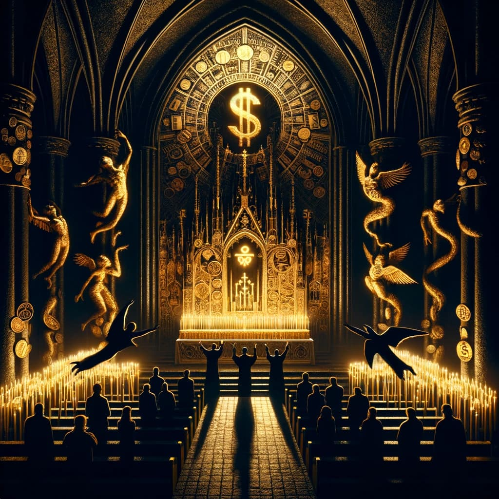

---

# El Altar del Capital: Una Meditación sobre la Religión y la Economía

**La sacralidad del capitalismo: ¿Una nueva fe?**

En "El capitalismo como religión", Walter Benjamin plantea una visión provocativa del capitalismo, sugiriendo que no es meramente un sistema económico, sino una religión en sí misma. Esta idea, aunque radical, nos invita a reflexionar: ¿Hasta qué punto nuestras vidas están imbuidas en las prácticas y creencias capitalistas? ¿Es posible que el capitalismo haya trascendido su papel económico para convertirse en un credo que guía nuestras existencias?

> ¿Puede realmente un sistema económico asumir el papel de una religión en la vida de las personas?

**El Culto Sin Fin: Adoración en la Bolsa y la Tienda**

Benjamin argumenta que el capitalismo se caracteriza por ser un "culto permanente", sin un dogma o teología definida. Esta característica lo convierte en una religión de adoración constante, donde los actos de consumo, inversión y acumulación de riqueza son sus rituales sagrados. En el mundo actual, con el auge del consumismo y la globalización, esta idea parece más relevante que nunca.

> ¿En qué medida los rituales de consumo y acumulación han reemplazado las prácticas religiosas tradicionales en nuestras sociedades?

**Dioses Ocultos y Deudas Eternas: El Pecado Capital del Capitalismo**

Una de las tesis más interesantes de Benjamin es que el capitalismo, a diferencia de otras religiones, no ofrece expiación para la culpa, sino que la perpetúa y la hace universal. Esto plantea una profunda crítica social, sugiriendo que el sistema capitalista crea una sensación constante de deuda y culpa, tanto financiera como moral.

> ¿Cómo afecta la perpetua sensación de deuda y culpa impuesta por el capitalismo a la psique humana?

**Contrapuntos y Controversias: Una Mirada Crítica**

Mientras que la visión de Benjamin es intrigante, hay argumentos contrarios que sugieren que el capitalismo, más que una religión, es un sistema flexible y pragmático que responde a las necesidades humanas de intercambio y mejora. Autores como Max Weber han destacado cómo el capitalismo ha fomentado la racionalidad y la eficiencia, distanciándose de las concepciones religiosas.

> ¿Es el capitalismo realmente una fuerza irracional y religiosa, o un sistema económico racional orientado a la eficiencia?

**Conexión con el Presente: Reflexiones en la Era Digital**

Al analizar la relevancia de "El capitalismo como religión" en el contexto actual, es imposible ignorar el impacto de la tecnología y la digitalización en la expansión del capitalismo. Las redes sociales, la publicidad en línea y el comercio electrónico han transformado no solo cómo consumimos, sino cómo vivimos y nos relacionamos con el mundo.

> ¿Están las nuevas tecnologías intensificando el carácter religioso del capitalismo, creando una nueva forma de adoración digital?

**Reflexiones Finales: Más Allá del Dinero y la Fe**

"El capitalismo como religión" de Walter Benjamin nos invita a reflexionar críticamente sobre la naturaleza y el impacto del sistema capitalista en nuestras vidas. Mientras que la interpretación de Benjamin es sin duda polémica, su capacidad para desencadenar un diálogo significativo sobre nuestra relación con el dinero, el poder y la espiritualidad es innegable.

> ¿Cómo podemos reconciliar nuestras necesidades materiales con nuestra búsqueda de significado y propósito en un mundo dominado por el capitalismo?

---
