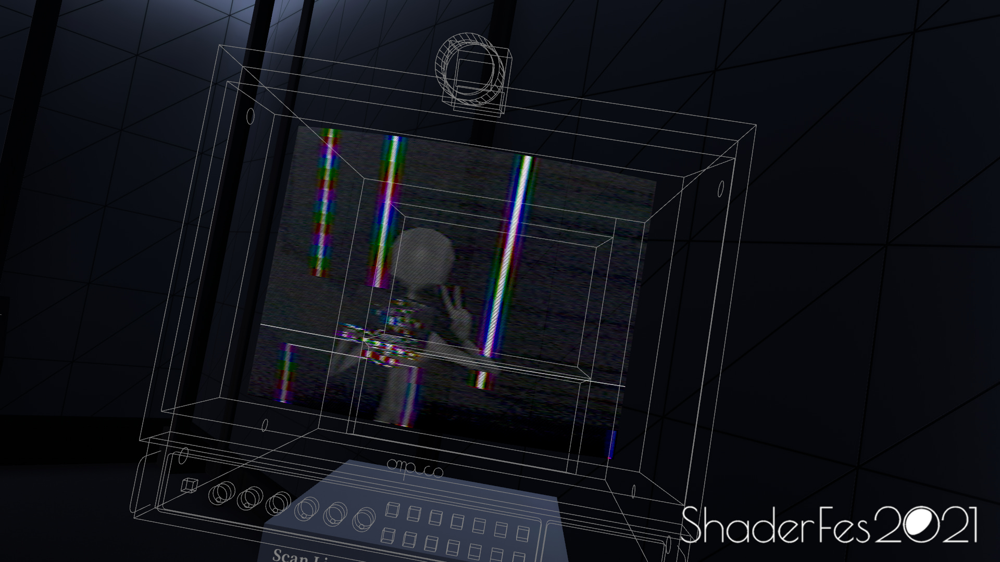

Entre los infinitos lugares que una consciencia virtual puede visitar, hay un bello lugar escondido entre los inacabables mundos de VRChat—un **museo dedicado al hermoso arte del _shader_**. Como todo en la vida, siempre hay mejores maneras de disfrutar ciertas experiencias y, en definitiva, ésta debe hacerse en realidad virtual (y algo más).

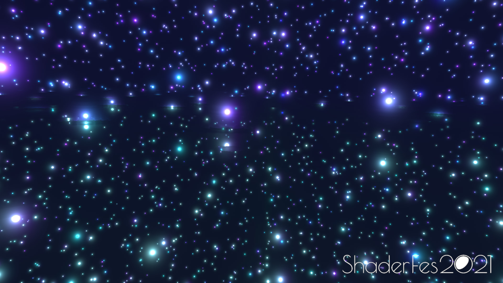

Pero... ¿Exactamente qué es un shader? Hay bastantes maneras de describir lo que son—creo que la más directa de explicar, con un poco de bagaje teórico computacional, es:

> _Los shaders son un tipo de programa ejecutado completamente en la GPU que aprovecha la arquitectura en paralelo (de la GPU) para ejecutarse de manera mucho más rápida que en la CPU._

Creo que la mejor demostración para entender bien por qué son tan potentes está en este [video](https://www.youtube.com/watch?v=-P28LKWTzrI). Es por eso que las GPUs han sido esclavizadas por el capitalismo digital como centros de mina de criptomonedas. También se aprovechan para potenciar el malabarismo estadístico y aproximarnos a la singularidad con algoritmos cada vez más sintientes de IA.

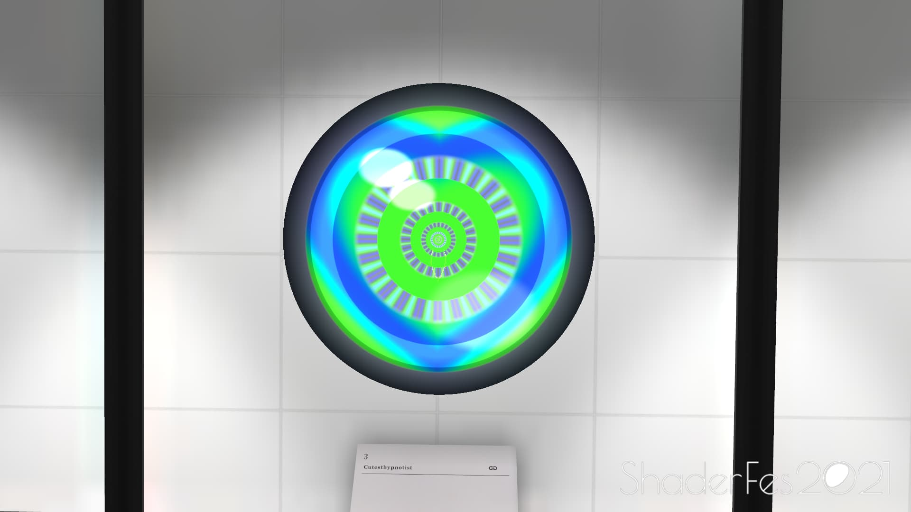

Regresando a un contexto más artesanal,

> _un shader nos permite especificar el color de un pixel. Como se ejecuta de manera paralela estamos literalmente especificando el color de muchos píxeles al mismo tiempo. Si le añadimos tiempo y trigonometría, tenemos objetos 3D animados y plasmados en la pantalla_.

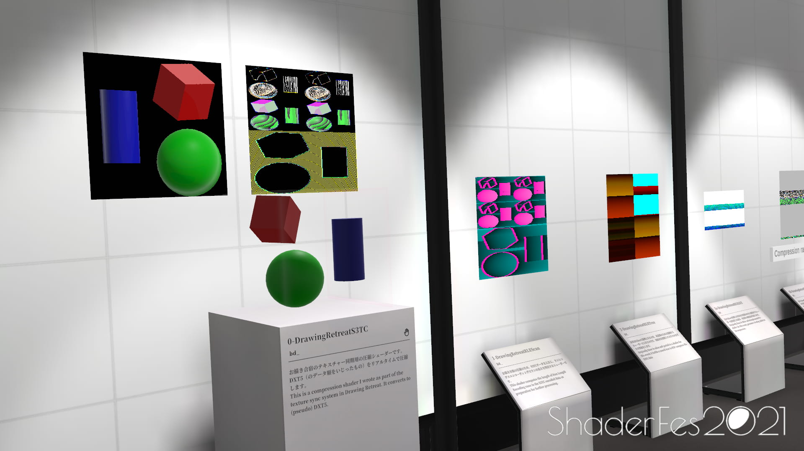
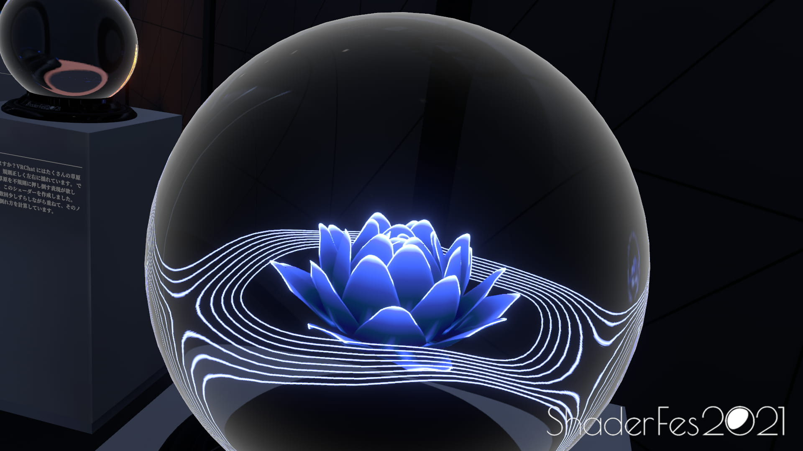

Cabe aclarar que todo es una ilusión—sí, seguimos viendo una pantalla en 2D, pero a través de la prestidigitación lumínica percibimos entidades como si fueran en 3D, pero siguen "estando" en un plano x, y. Es por eso que los shaders son utilizados para las partes más visualmente intensivas de un programa gráfico.

Son los que me hacen salir bien en mis selfies:

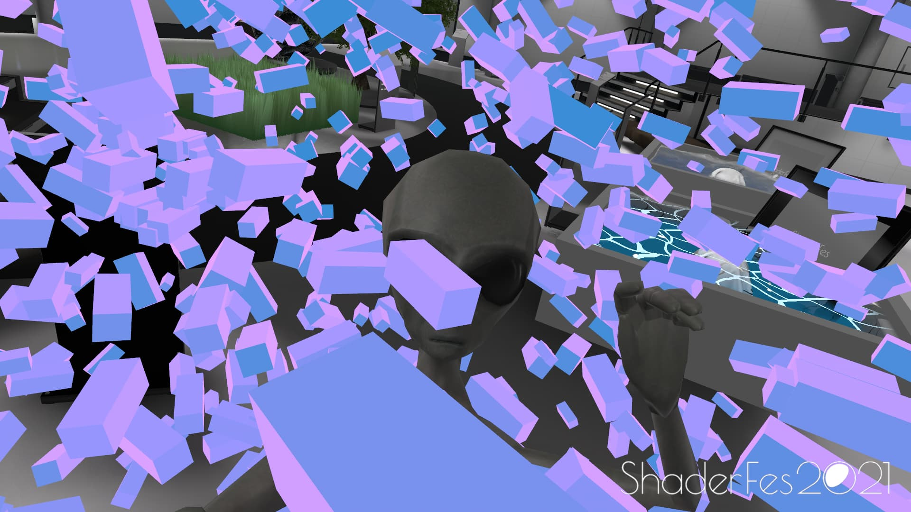
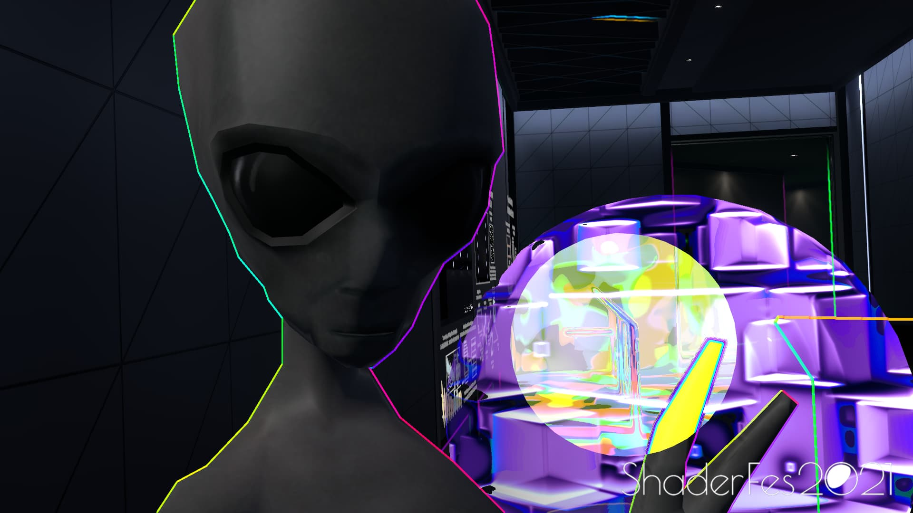
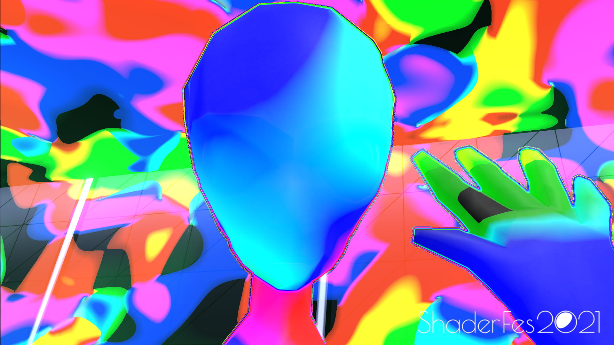

Una vez que entendemos técnicamente los shaders podemos vislumbrar la divina belleza geométrica de la existencia. La eficiencia del GPU permite renderizar mundos virtualmente infinitos—me consta, he estado dentro de ellos. ¿Podrán decirnos algo estos sistemas sobre nuestra realidad no-virtual? ¿Será que la existencia es, en efecto, un fractal?

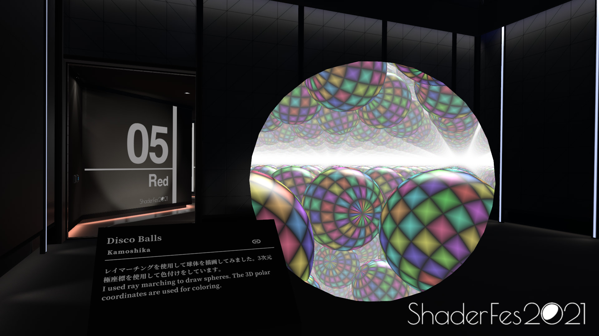
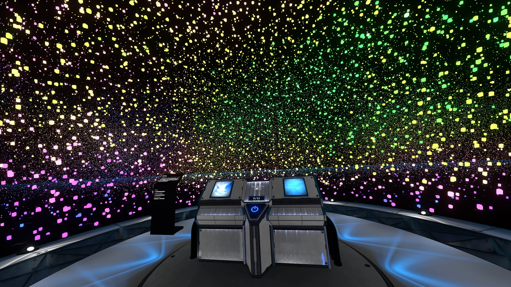

---

No miento—realmente visitar este lugar es una experiencia alucinante tanto técnica como artísticamente. A diferencia del aborrecible metaverso centralizado de Facebook, es aquí donde me doy cuenta del **poder de la comunidad**. Este mundo fue hecho por usuarios de VRChat por el puro placer de exhibir su arte con los demás a través de nuevos medios. Se nota en su diversidad y creatividad única de cada pieza.

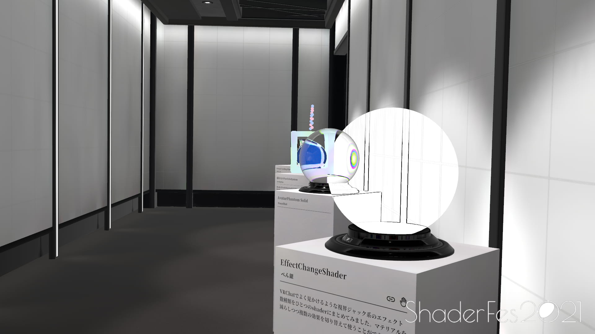
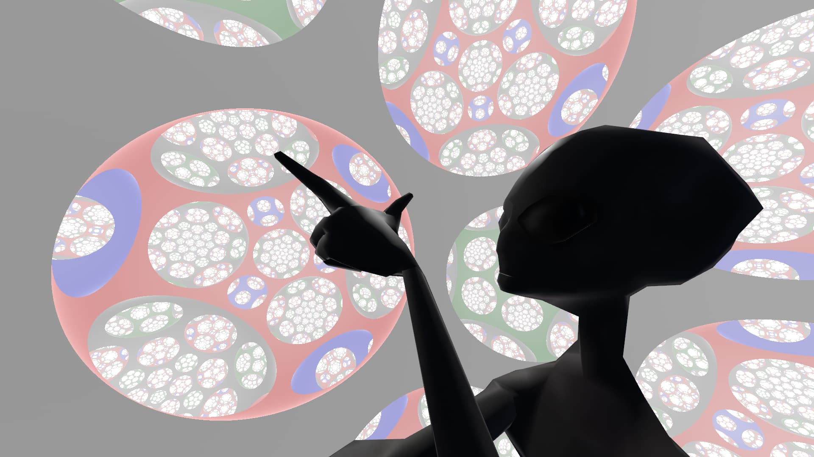

> _Tómame una foto como si no me doy cuenta que estoy dentro de un espacio hiperbólico en 3D..._

---

_Post.data_: Todas las fotos las tomé en RV. Hay más. La música que estaba escuchando mientras escribía esto es [esta](https://www.youtube.com/watch?v=lkSVvr4bCLs).
